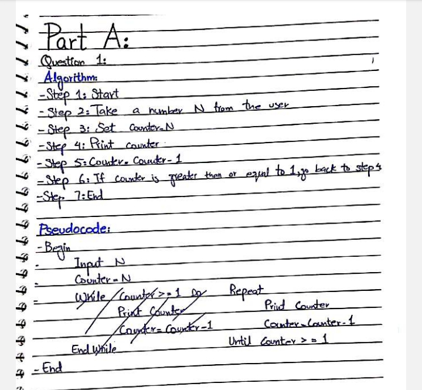
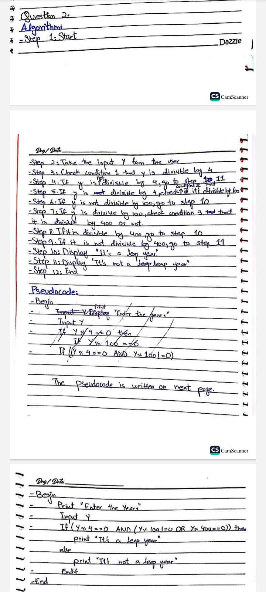
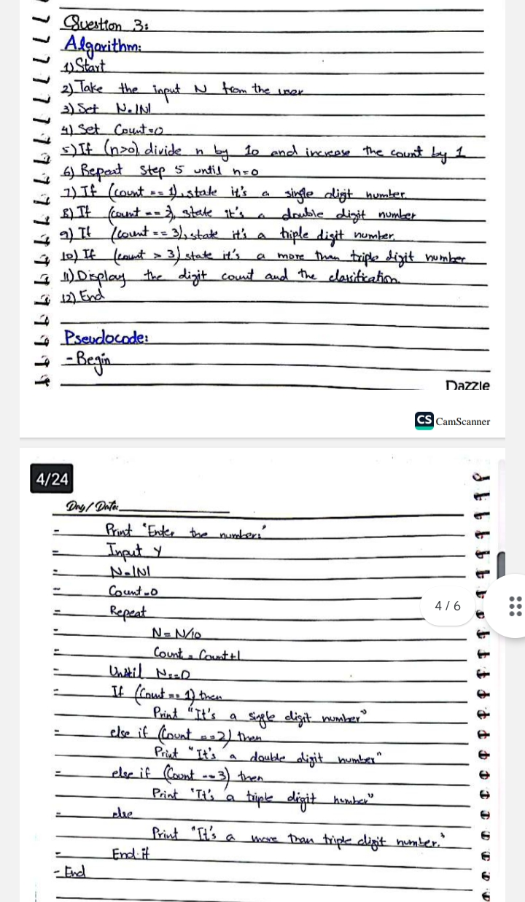
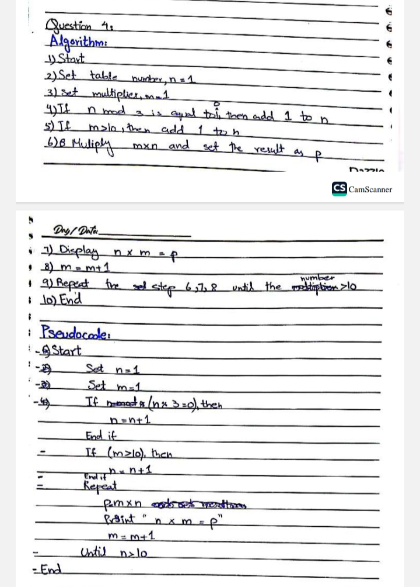
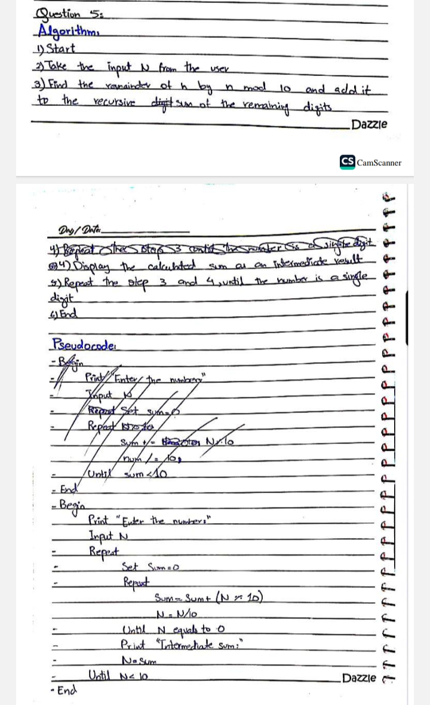

# Part A - Foundational Practice Problems

**Name:** KHADIJA  
**ID:** 26K-0027  
**Section:** BAI-A  

This folder contains 5 basic C problems with code and outputs.

### Q1: Print numbers from N down to 1

### Q2: Leap Year Checker

### Q3: Count digits - Single/Double/Triple

### Q4: Multiplication tables skipping multiples of 3

### Q5: Sum digits until single digit

