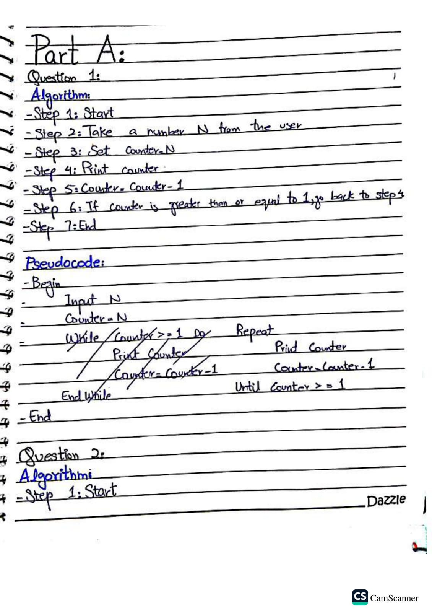
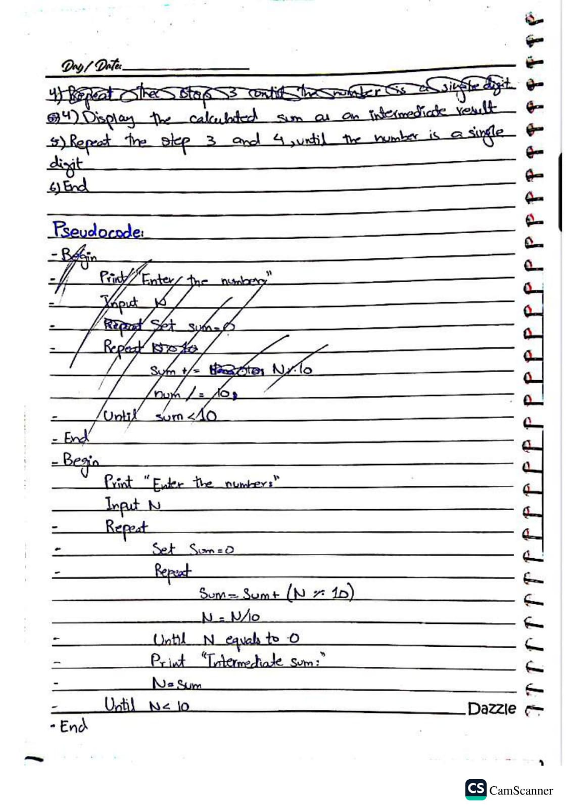
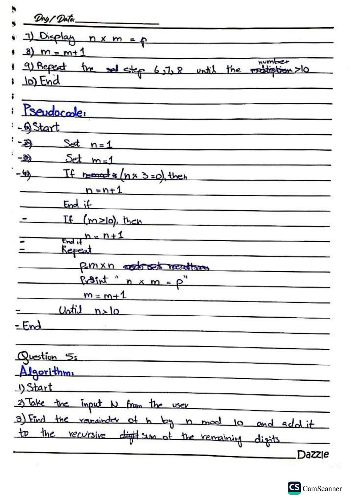
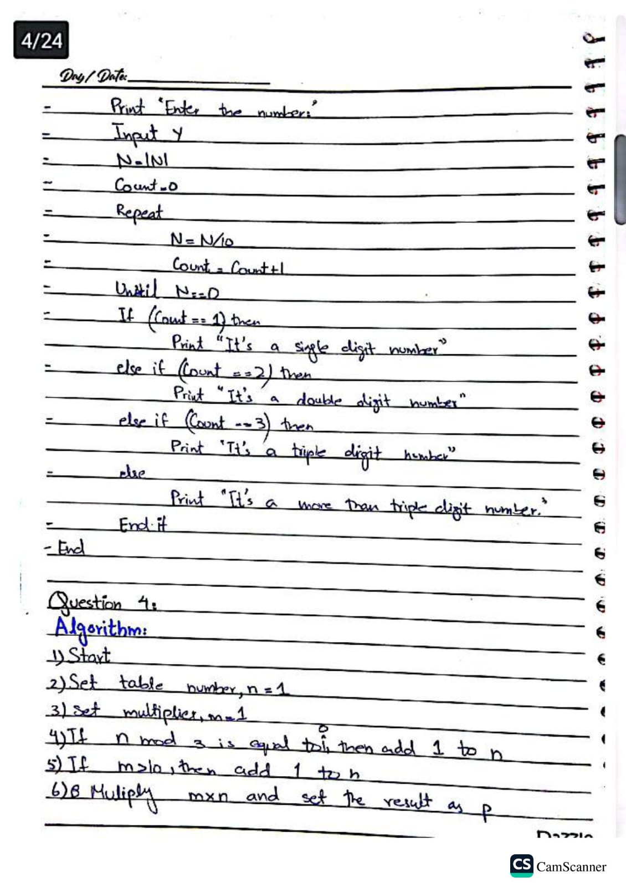
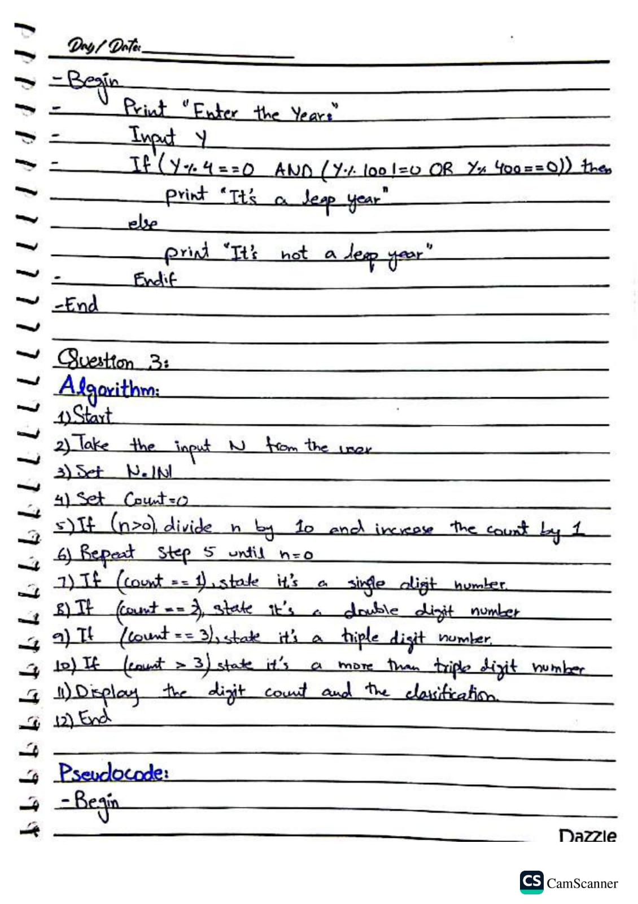
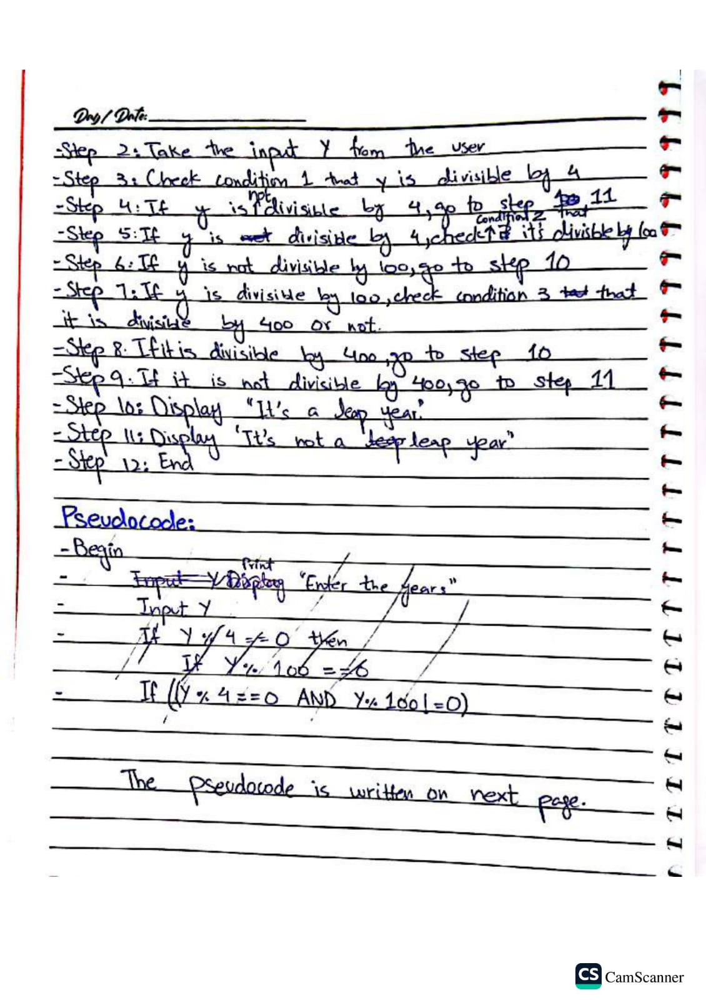

# Part A - Foundational Practice Problems

**Name:** KHADIJA  
**ID:** 26K-0027  
**Section:** BAI-A

This folder contains 5 basic C problems.

### Q1: Print numbers from N down to 1
Code: Q1.c (agar hai)
**Output:**

### Q2: Leap Year Checker
Code: Q2.c
**Output:**

### Q3: Count digits - Single/Double/Triple
Code: Q3.c
**Output:**

### Q4: Multiplication tables skipping multiples of 3
Code: Q4.c
**Output:**

### Q5: Sum digits until single digit
Code: Q5.c
**Output:**

### Extra Screenshot

