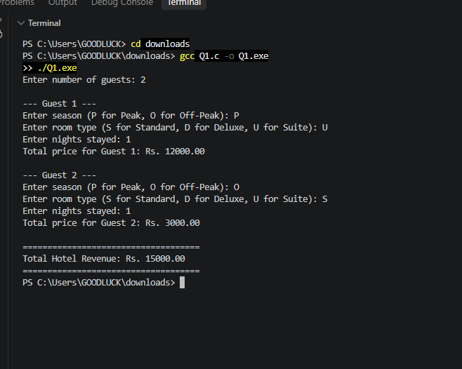

# Part B Q1 - Hotel Booking System

**Name:** KHADIJA  
**ID:** 26K-0027  
**Section:** BAI-A

**Description:** Hotel processes N guests, Peak / Off-Peak rates (Standard 5000/3000, Deluxe 8000/5000, Suite 12000/8000). If nights > 7, 15% discount. Total revenue calculated.

**Code File:** question 1

**Output Screenshot:**

**Algorithm / Flowchart Pages (PAC, IPO, Pseudocode):**
.jpeg)
.jpeg)
.jpeg)
.jpeg)
.jpeg)
