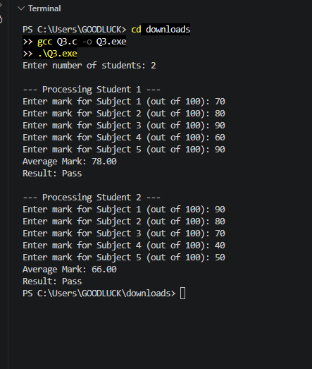

# Part B Q3 - Class Result Processing

**Name:** KHADIJA
**ID:** 26K-0027
**Section:** BAI-A

### Files
- Q3.exe - Executable
- question3 - Code File
- output3.PNG - Program Output
- 1.jpeg to 6.jpeg - Documentation Pages

### Output

### Documentation Pages

